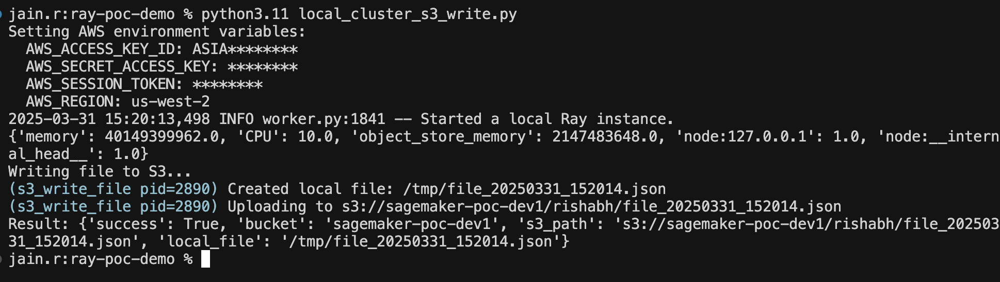

# Ray POC Demo

This repository demonstrates using Ray for distributed computing applications with both local file operations and AWS S3 integration.

## Overview

[Ray](https://docs.ray.io/en/latest/index.html) is a unified framework for scaling Python applications from a laptop to a cluster. This demo shows:

1. Local file operations using Ray
2. AWS S3 integration for cloud storage
3. Passing environment variables to Ray tasks


## Getting Started

### Prerequisites

- Python 3.11.9 (should be same as of Ray cluster)
- Ray 2.43.0
- Boto3 (for AWS integration)


### Running the examples

AWS file operations from local cluster :
```bash
python3.11 local_cluster_s3_write.py
```



## Remote cluster execution
Port forward
```

```

